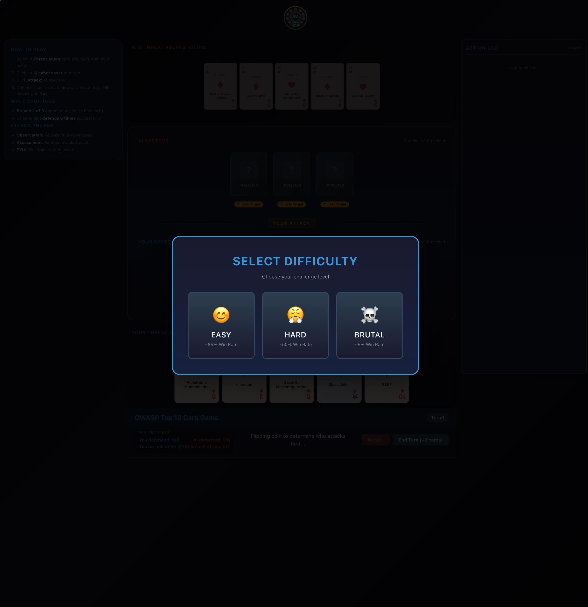
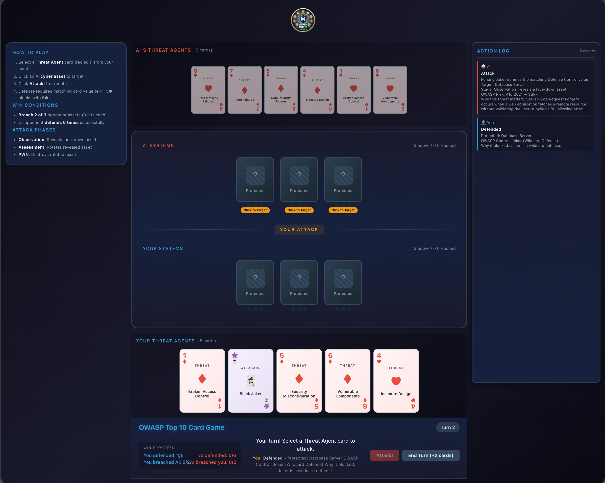

[](https://github.com/ThienMD/owasp-top10-card-game/actions/workflows/ci.yml)

[](https://thienmd.github.io/owasp-top10-card-game/)

## Screenshots

<p align="center">
  
  <br/>
  
</p>

# OWASP Top Ten Card Game

An educational card game based on the **official OWASP Top Ten Card Game rules**. Learn about web security vulnerabilities and defenses while playing against a rule-based AI opponent.

**Based on**: [OWASP Top Ten Card Game Project](https://owasp.org/www-project-top-ten-card-game/)

## Quick Start

```bash
# Install dependencies
npm install

# Start development server
npm run dev
```

Then open your browser to `http://localhost:5173`

## Official OWASP Rules

### Card Deck (Modified Poker Deck)

| Card Type | Suits | Purpose |
|-----------|-------|---------|
| **Threat Agent (TA)** | Hearts ♥, Diamonds ♦ (values 1-10) | Attack cards - each value maps to OWASP Top 10 |
| **Defense Control (DC)** | Spades ♠, Clubs ♣ (values 1-10) | Defense cards - each value maps to OWASP Proactive Controls |
| **Cyber Assets** | Face cards (J, Q, K) | Systems to protect/attack |
| **Jokers** | Black & Red | Wildcards for attack/defense |

### OWASP Mappings

**Card Values → OWASP Top 10 (2021)**
| Value | Risk |
|-------|------|
| 1 | A01: Broken Access Control |
| 2 | A02: Cryptographic Failures |
| 3 | A03: Injection |
| 4 | A04: Insecure Design |
| 5 | A05: Security Misconfiguration |
| 6 | A06: Vulnerable Components |
| 7 | A07: Authentication Failures |
| 8 | A08: Data Integrity Failures |
| 9 | A09: Logging Failures |
| 10 | A10: SSRF |

**Card Values → OWASP Proactive Controls**
| Value | Control |
|-------|---------|
| 1 | C1: Define Security Requirements |
| 2 | C2: Leverage Security Frameworks |
| 3 | C3: Secure Database Access |
| 4 | C4: Encode and Escape Data |
| 5 | C5: Validate All Inputs |
| 6 | C6: Implement Digital Identity |
| 7 | C7: Enforce Access Controls |
| 8 | C8: Protect Data Everywhere |
| 9 | C9: Implement Logging & Monitoring |
| 10 | C10: Handle All Errors |

### Setup

- Each player receives **3 cyber assets** (face-down)
- Each player draws **5 Threat Agent cards** and **5 Defense Control cards**
- Player attacks first

### Attack Progression (3 Phases)

Each asset must be hit 3 times to be destroyed:

1. **Observation**: First hit reveals a face-down asset
2. **Assessment**: Second hit rotates the revealed asset
3. **PWN**: Third hit destroys the rotated asset

### Defense Mechanics

- Defense requires **matching card values**: DC# = TA#
- Example: 5♥ (Threat) is blocked by 5♠ (Defense)
- **Jokers are wildcards** - can attack or defend against any value
- Successful defense discards both cards and grants **2 bonus cards**

### Turn Flow

1. Attacker plays Threat Agent cards against defender's assets
2. Defender can block with matching Defense Control cards
3. Attacker can continue attacking or end turn (draw 2 cards)
4. Roles switch

### Win Conditions

- **Breach Victory**: Destroy 2 of 3 opponent assets (6 successful attacks)
- **Defense Victory**: Successfully defend 6 attack sequences

## AI Behavior

The AI uses rule-based decision making:

1. **Target Priority**: Attacks assets closest to destruction (rotated > revealed > facedown)
2. **Defense Strategy**: Uses matching cards when available, saves Jokers for critical moments
3. **Continuation**: Continues attacking if close to destroying an asset

## Project Structure

```
owasp-card-game/
├── src/
│   ├── components/         # React UI components
│   │   ├── Card.tsx        # Poker-style card display
│   │   ├── CyberAsset.tsx  # Face card / asset display
│   │   ├── Hand.tsx        # Player hand display
│   │   ├── Board.tsx       # Game board with assets
│   │   ├── Tooltip.tsx     # OWASP info popup
│   │   └── GameStatus.tsx  # Game status and controls
│   ├── data/
│   │   └── cards.ts        # Card definitions & OWASP mappings
│   ├── hooks/
│   │   └── useGameState.ts # Game state management
│   ├── types/
│   │   └── index.ts        # TypeScript definitions
│   ├── utils/
│   │   ├── ai.ts           # AI decision logic
│   │   └── helpers.ts      # Utility functions
│   ├── App.tsx             # Main app component
│   └── main.tsx            # Entry point
├── index.html
├── package.json
├── tsconfig.json
└── vite.config.ts
```

## Technologies

- **React 18** - UI framework
- **TypeScript** - Type safety
- **Vite** - Build tool
- **Pure CSS** - No external UI libraries

## Build for Production

```bash
npm run build
npm run preview
```

## Educational Purpose

This game teaches OWASP security concepts:

- **When attacking**: Learn about the OWASP Top 10 vulnerabilities
- **When defending**: Learn about OWASP Proactive Controls
- **Card matching**: Understand how specific controls mitigate specific risks

Each card displays educational information when played.

## References

- [OWASP Top Ten Card Game](https://owasp.org/www-project-top-ten-card-game/)
- [OWASP Top 10 2021](https://owasp.org/Top10/)
- [OWASP Proactive Controls](https://owasp.org/www-project-proactive-controls/)

## License

MIT
